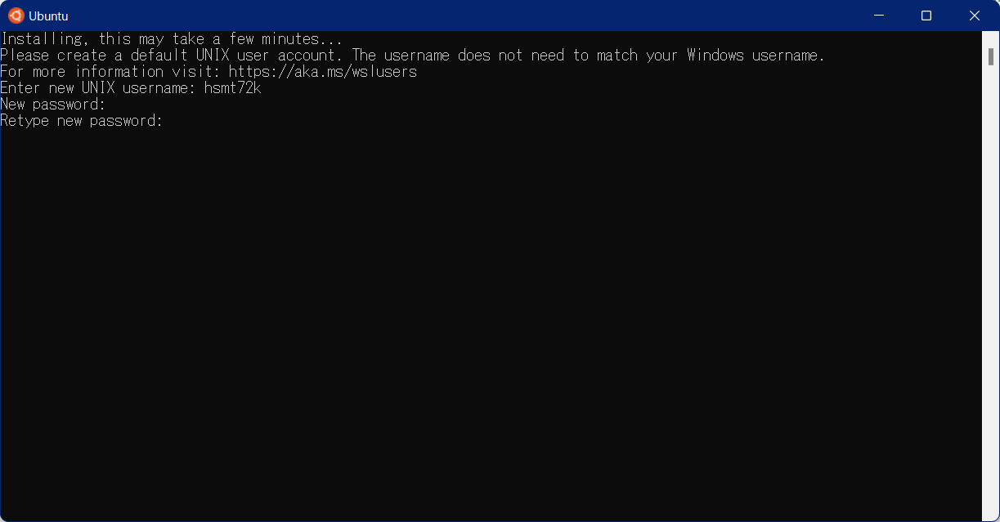

# Docker Desktop for Windows をインストール

## WSL をインストール

最新の Windows では、すでに WSL2 がインストールされているが、
以下の手順で、Linux Kernel のアップデートと、Linux ディストリビューションのインストールが必要になる。

### WSL の更新

WSL2 の Linux Kernel をアップデートするために、以下のコマンドを実行する。

``` console
wsl --update
```

### Ubuntu のインストール

Ubuntu や Debian など、WSL2 で利用するディストリビューションをインストールする必要がある。

Ubuntu をインストールする場合は、以下のコマンドを実行する。

``` console
wsl --install -d Ubuntu
```

### ユーザ名とパスワードの設定

Ubuntu のインストールが完了すると、Ubuntu が起動する。



以下の入力が求められるので、順番に入力していく。

- UNIX ユーザ名
- パスワード
- パスワードの再入力

上記の入力が確認できると、Ubuntu のセットアップが完了する。


## Docker Desktop for Windows のインストール

Windows に Winget をインストールできている場合は、
以下のコマンドで、Docker Desktop for Windows をインストールできる。

``` console
winget install -e --id Docker.DockerDesktop
```

## Docker Desktop for Windows の起動

インストールした Docker Desktop for Windows を起動してみる。


起動すると、以下のようにチュートリアルを行うことができる。

Start ボタンを押してチュートリアルを開始してみる。

以下は、チュートリアルの日本語訳。

## Docker Desktop First Tutorial

### まず、リポジトリをクローンする

Getting Started プロジェクトは、イメージをビルドしてコンテナとして実行するために
必要なものがすべて入った、シンプルな GitHub のリポジトリです。

コンテナでGitを実行して、リポジトリをクローンします。

``` console
docker run --name repo alpine/git clone https://github.com/docker/getting-started.git
```

``` console
docker cp repo:/git/getting-started/ .
```

また、コマンドラインインターフェイスで直接コマンドを入力することもできます。

### イメージの構築

Docker イメージは、あなたのコンテナのためのプライベートなファイルシステムです。

これは、コンテナに必要なすべてのファイルとコードを提供します。

``` console
cd ./getting-started
```

``` console
docker build -t docker101tutorial .
```

### 最初のコンテナを実行する

前のステップでビルドしたイメージに基づいて、コンテナを起動します。

コンテナを実行すると、マシンの他の部分から安全に分離された
プライベートなリソースでアプリケーションが起動します。

``` console
docker run -d -p 80:80 --name \
  --name docker-tutorial docker101tutorial
```

Docker コンテナが起動すると、Windows Defender ファイアウォールでブロックされるので、
表示されるダイアログの「アクセスを許可する」ボタンをクリックする。


ブラウザを開いて以下のアドレスを入力すると、
コンテナ内で起動しているサーバに接続されページが表示される。

http://localhost/

### Docker Desktop の確認

コンテナが起動していれば、Docker Desktop には、
以下のように起動したコンテナが緑色のアイコンで表示される。


この起動コンテナの `Action` 列にある `■` ボタンを押せばコンテナを停止させることができる。

また、ゴミ箱ボタンを押せば、コンテナを削除することができる。

### コマンドでの起動コンテナの確認方法

docker ps コマンドで、起動しているコンテナ一覧を確認することができる（ps はプロセス process の略）。

`起動中のコンテナを表示`
``` console
docker ps
```

`docker ps の実行結果`
``` console
CONTAINER ID   IMAGE               COMMAND                  CREATED         STATUS         PORTS                NAMES
b506ce5cb431   docker101tutorial   "/docker-entrypoint.…"   8 minutes ago   Up 8 minutes   0.0.0.0:80->80/tcp   docker-tutorial
```

### コマンドでのコンテナ停止方法

docker コンテナを停止するには、docker stop コマンドを実行する。

複数のコンテナが起動している場合は、`CONTAINER ID` を指定して docker stop コマンドを実行する。

`docker stop の実行例`
``` console
docker stop b506ce5cb431
```

### コマンドでのコンテナ削除方法

docker コンテナを削除するには、docker rm コマンドを実行する。

`docker rm の実行例`
``` console
docker rm b506ce5cb431
```

### コマンドでのイメージ一覧の取得

docker images コマンドを実行すると、ローカルに保存されている全てのイメージを表示することができる。

`Docker イメージ一覧の取得`
``` console
docker images
```

`docker images コマンドの実行結果例`
``` console
REPOSITORY          TAG       IMAGE ID       CREATED          SIZE
docker101tutorial   latest    a873d068b8cb   28 minutes ago   28.9MB
alpine/git          latest    b80d2cac43e4   3 days ago       43.6MB
```

### コマンドでのイメージの削除

次のコマンドは、docker images -q で全イメージのIDを取得し、それを docker rmi に渡すことで、
ローカルにある全ての Docker イメージを削除している。

`ローカルのすべての Docker イメージを削除`
``` console
docker rmi $(docker images -q)
```

`実行結果例`
``` console
Untagged: docker101tutorial:latest
Deleted: sha256:a873d068b8cb6d735138baf5f8070331e60036a760e5bf6221374302b6740e0a
Untagged: alpine/git:latest
Untagged: alpine/git@sha256:ec491c893597b68c92b88023827faa771772cfd5e106b76c713fa5e1c75dea84
Deleted: sha256:b80d2cac43e471c2bc5cfe547a45104e69e1b194f6f3f15ba1214f5e3020575e
Deleted: sha256:535f7a97a09b20654c90c6ffec564815ca9fa8bdbd648c3bc4c10479167988c7
Deleted: sha256:8259a6508146e1468dc4d7fdca54ae12fca0237f1ad2ff854aa19321292b34a7
```

以上。
